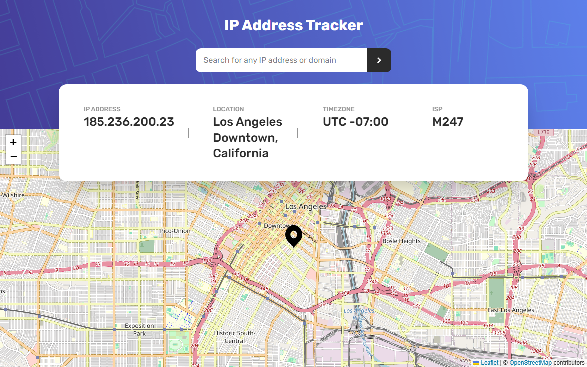

# Frontend Mentor - IP address tracker

This is a solution to the [IP address tracker challenge on Frontend Mentor](https://www.frontendmentor.io/challenges/ip-address-tracker-I8-0yYAH0). Frontend Mentor challenges help you improve your coding skills by building realistic projects. 
 


## Table of contents

- [Overview](#overview)
  - [The challenge](#the-challenge)
  - [Screenshot](#screenshot)
  - [Links](#links)
- [My process](#my-process)
  - [Built with](#built-with)
  - [What I learned](#what-i-learned)
  - [Useful resources](#useful-resources)
- [Author](#author)


## Overview

### The challenge

Users should be able to:

- View the optimal layout for each page depending on their device's screen size
- See hover states for all interactive elements on the page
- See their own IP address on the map on the initial page load
- Search for any IP addresses or domains and see the key information and location


### Screenshot




### Links

- Solution URL: [solution URL](https://github.com/itksweb/ip-address-tracker)
- Live Site URL: [live site URL](https://ip-address-tracker-delta-seven.vercel.app/)

## My process

### Built with

- [React](https://reactjs.org/) - JS library
- [Tailwind CSS](https://tailwindcss.com/)


### What I learned


```jsx
const DataPiece = ({ label, data, pre }) => {
    const hasBorder = ["isp", "location", "timezone"].includes(label);
    const obj = typeof data === "object";
    return (
      <div className="sm:flex items-start h-full">
        {hasBorder ? (
          <span className="max-lg:hidden lg:mr-10 h-5 w-[1px] bg-justDark self-center"></span>
        ) : null}
        <div id={label} className={`text-center sm:text-left px-2.5 `}>
          <h2 className="font-medium text-justDark uppercase max-xs:text-[0.7em] text-[0.8em] ">
            {label}
          </h2>
          <p className="font-medium text-veryDark lg:text-2xl md:max-lg:text-xl text-lg ">
            {pre ? `${pre} ` : null}
            {obj ? `${data?.city}, ${data?.region}` : data}
          </p>
          {obj ? <p>{data?.postalCode}</p> : null}
        </div>
      </div>
    );
  };

  useEffect(() => {
    const fetchUserIp = async () => {
      const storedData = localStorage.getItem("data");
      if (!storedData) {
        const data = await getData(url);
        console.log("foreign data");
        localStorage.setItem("data", JSON.stringify(data));
        return setData({ ...data });
      }
      setData(JSON.parse(storedData));
      console.log("local data");
    };
    fetchUserIp();
  }, []);
```

### Useful resources
 - [IP Geolocation API by IPify](https://geo.ipify.org/)
 - [LeafletJS](https://leafletjs.com/)


## Author

- WhatsApp - [here](https://wa.me/2348060719978)
- LinkedIn - [here](https://www.linkedin.com/in/kingsleyikpefan)
- Frontend Mentor - [here](https://www.frontendmentor.io/itksweb)


